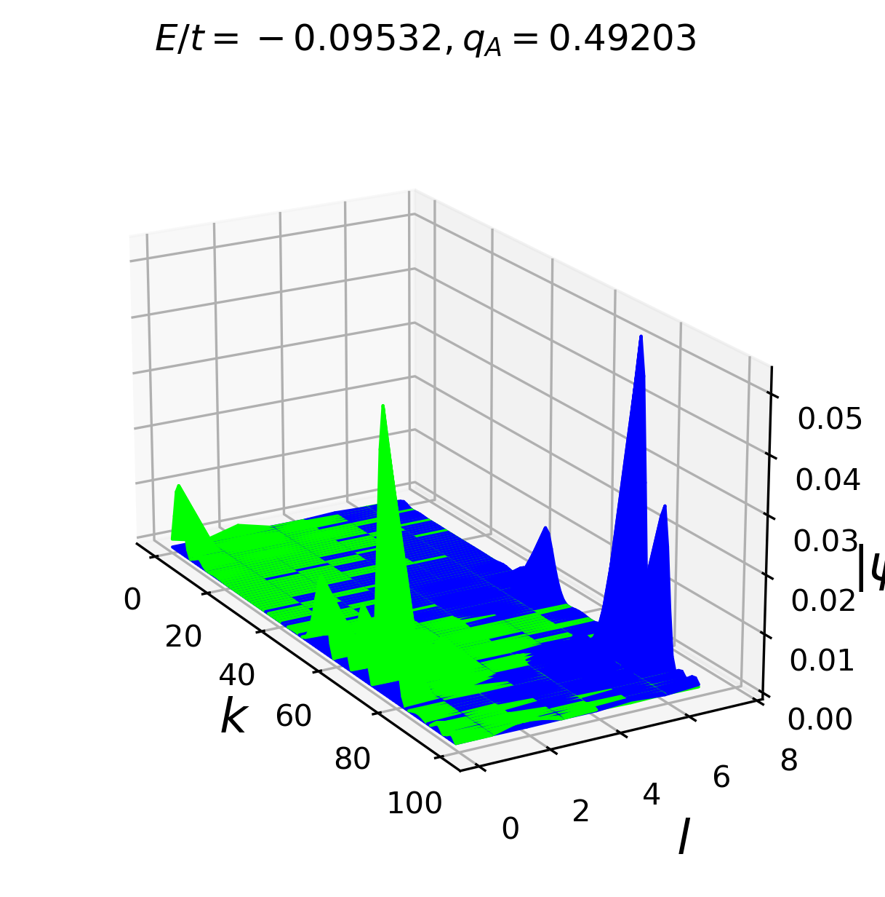
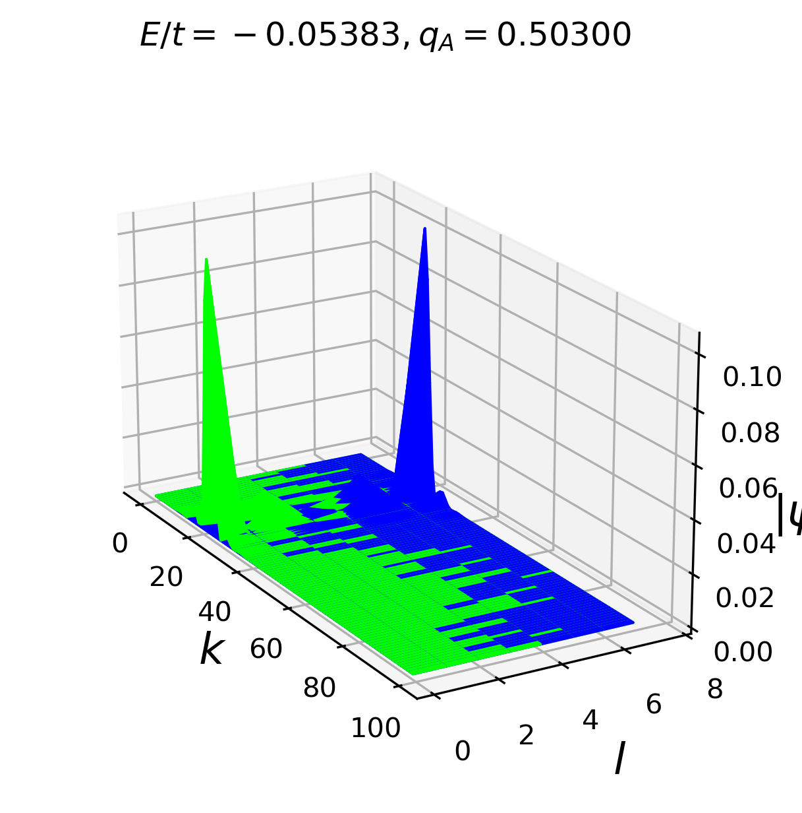
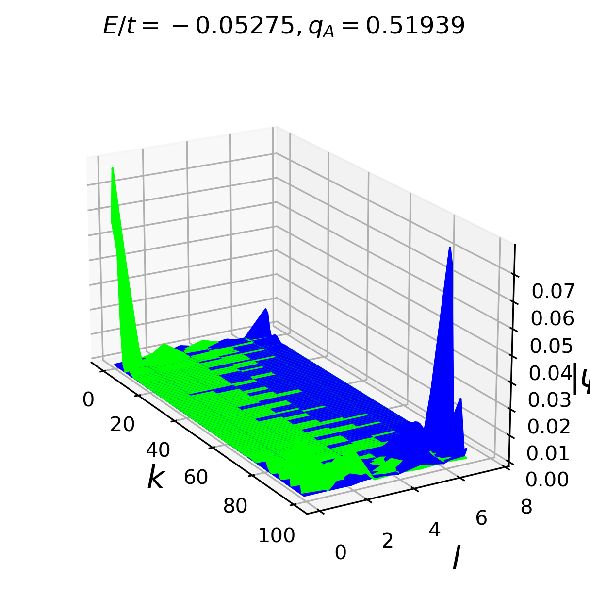
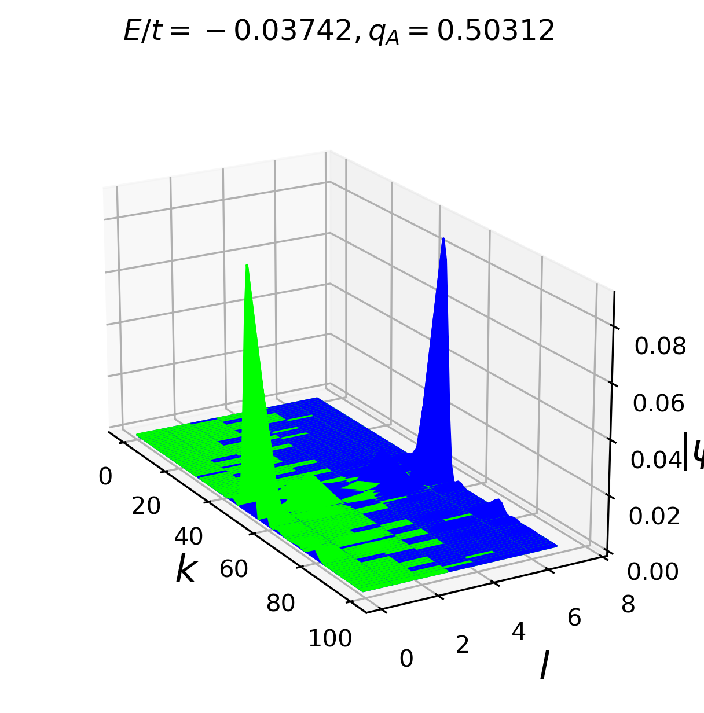
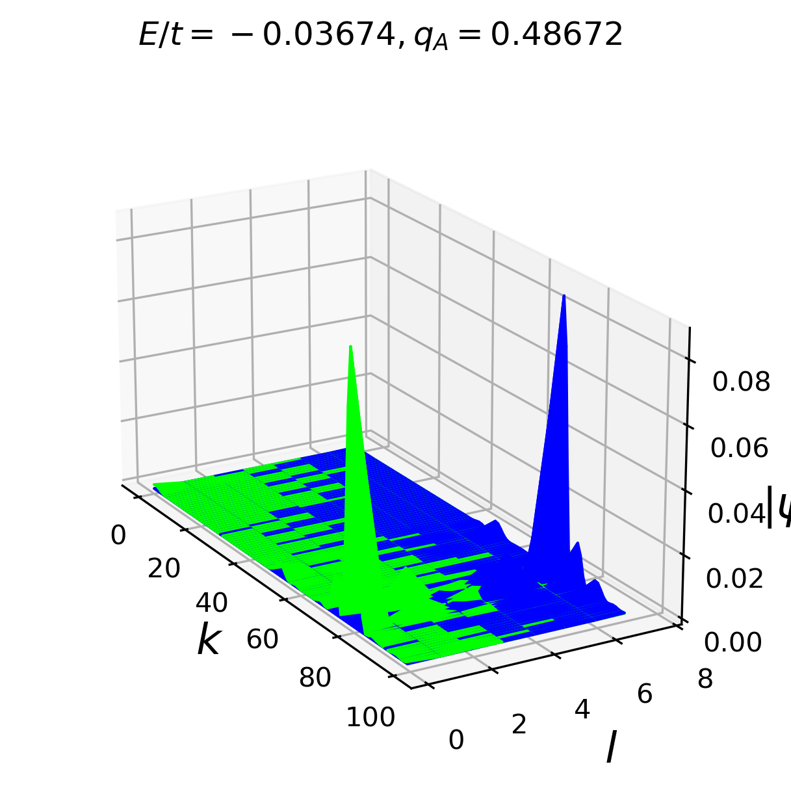
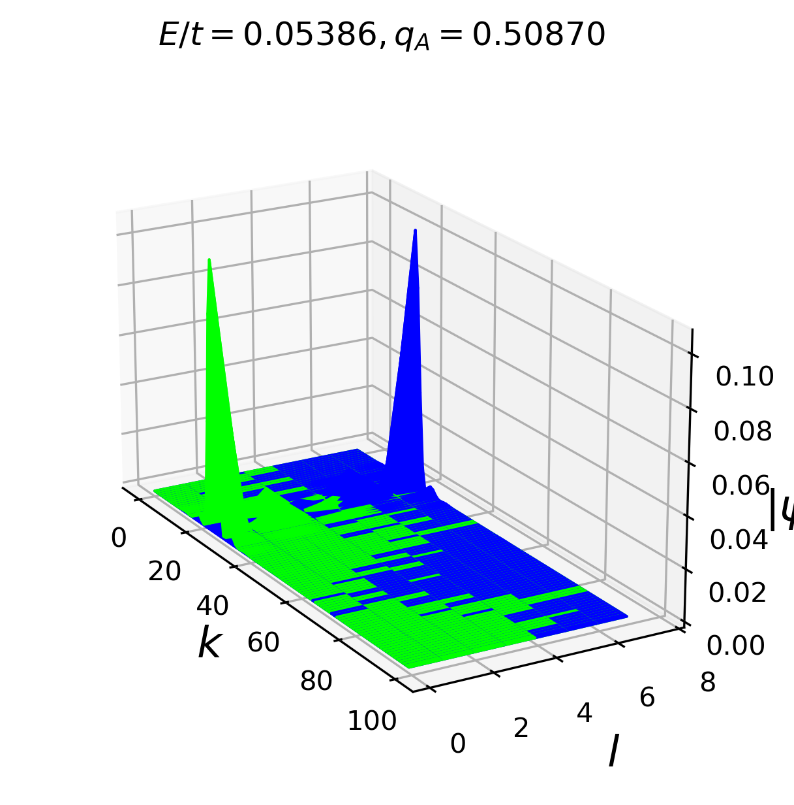
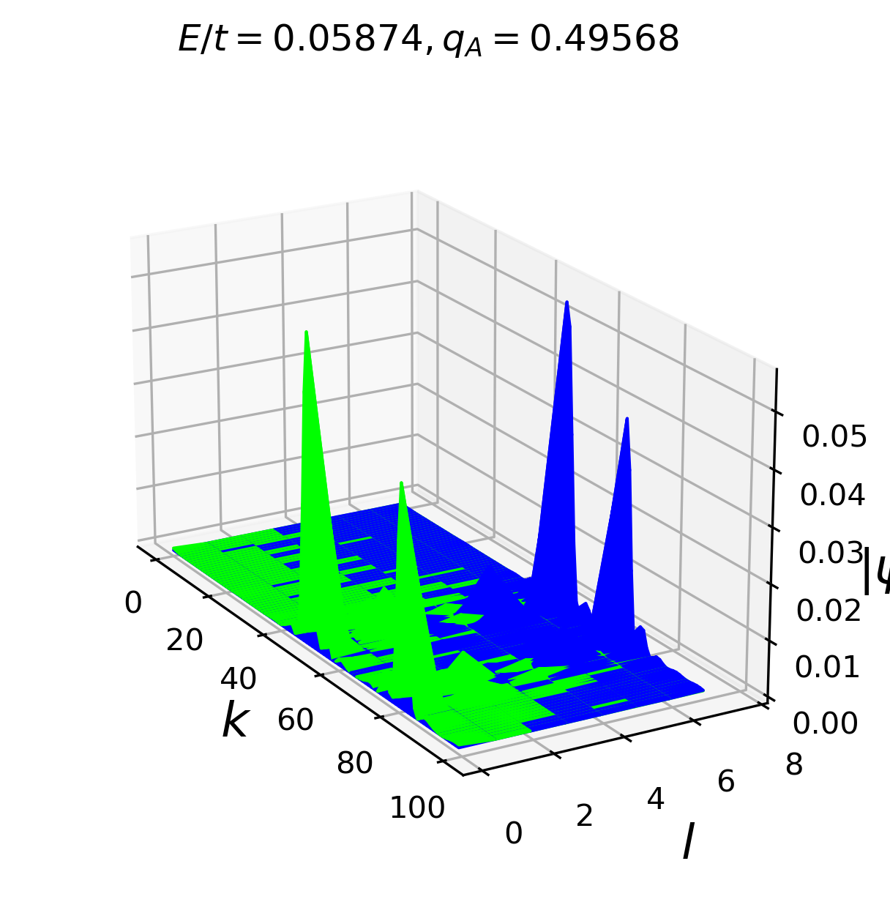
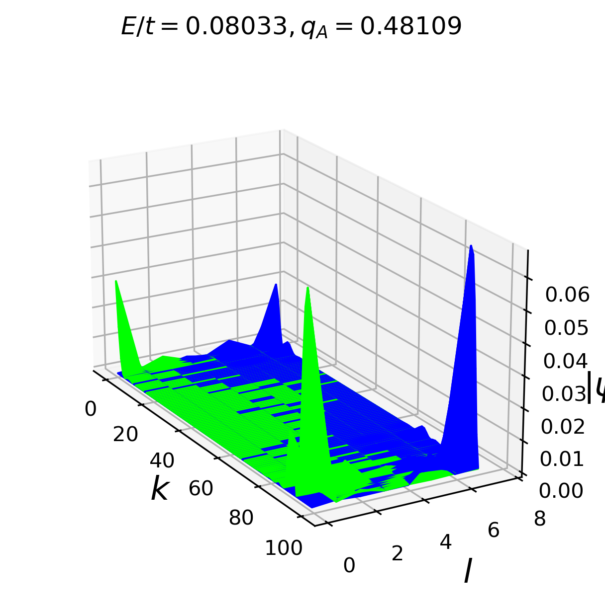

Run `plot_fractional_charge.py` to generate the state images in this folder.

Here are the visualizations of 10 states being nearest to the Fermi level. $U = t$ and $\Gamma = 0.01t$.

***Fractional charge***

***Fractional charge***

***Fractional charge***

***Fractional charge***

***Fractional charge***

