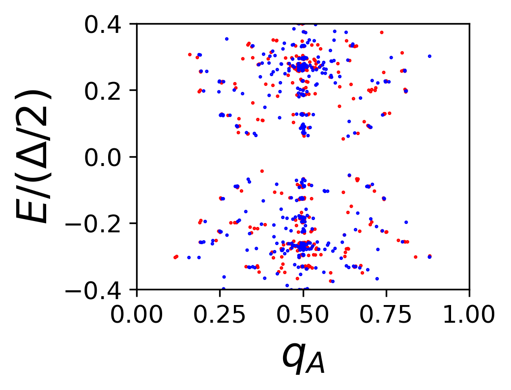
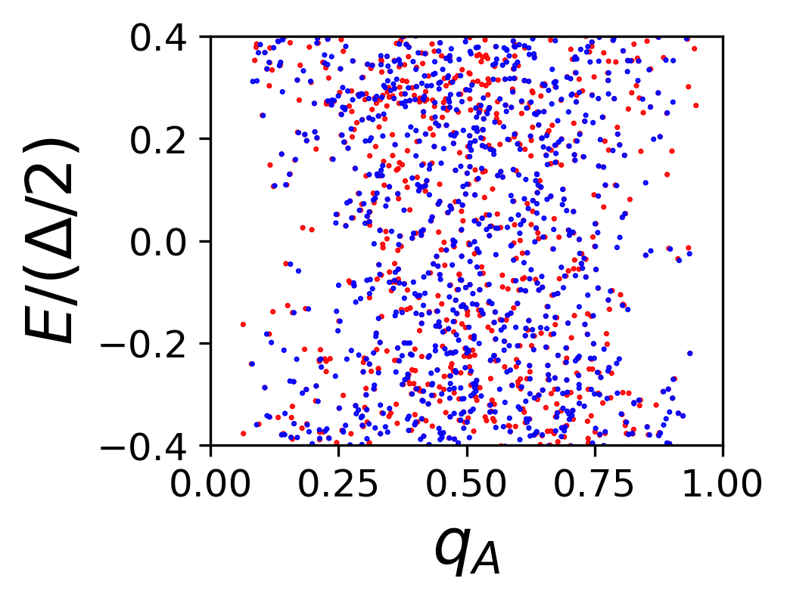

Run `plot_zgnr.py` for results in this folder. These results verify singular property of disorder potential and illustrates inaccuracy of charge quantization in the gap.

1. Symmetry protected phase

2. Topological order phase

3. Crossover phase 2

