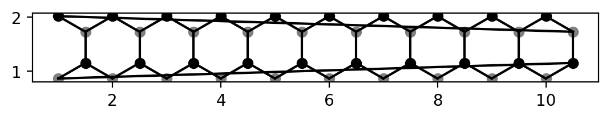
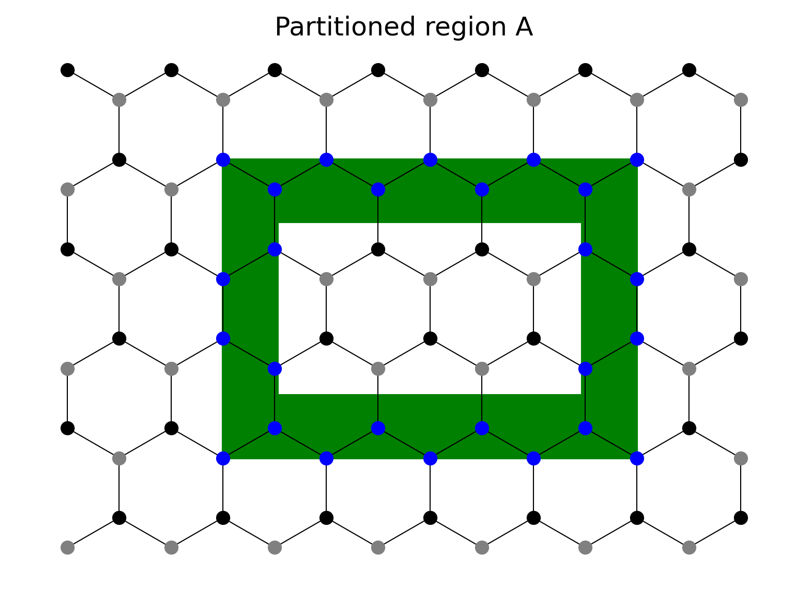
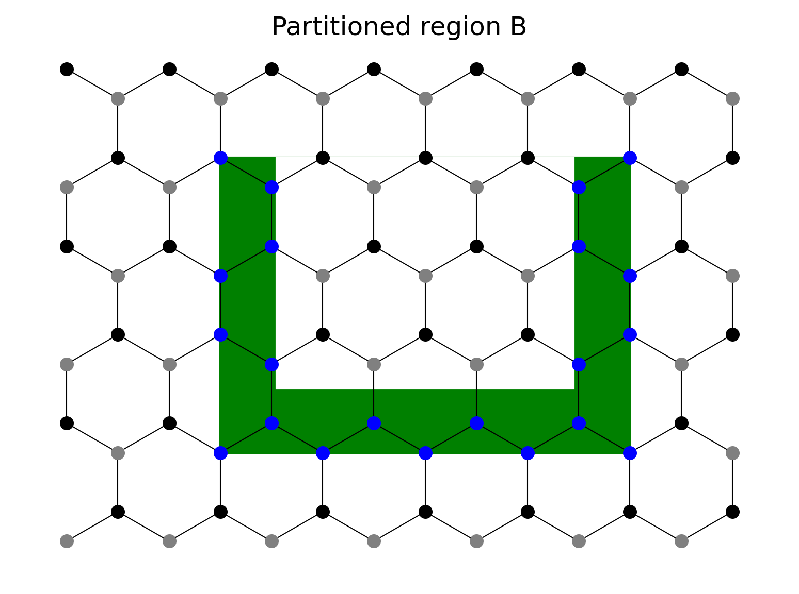
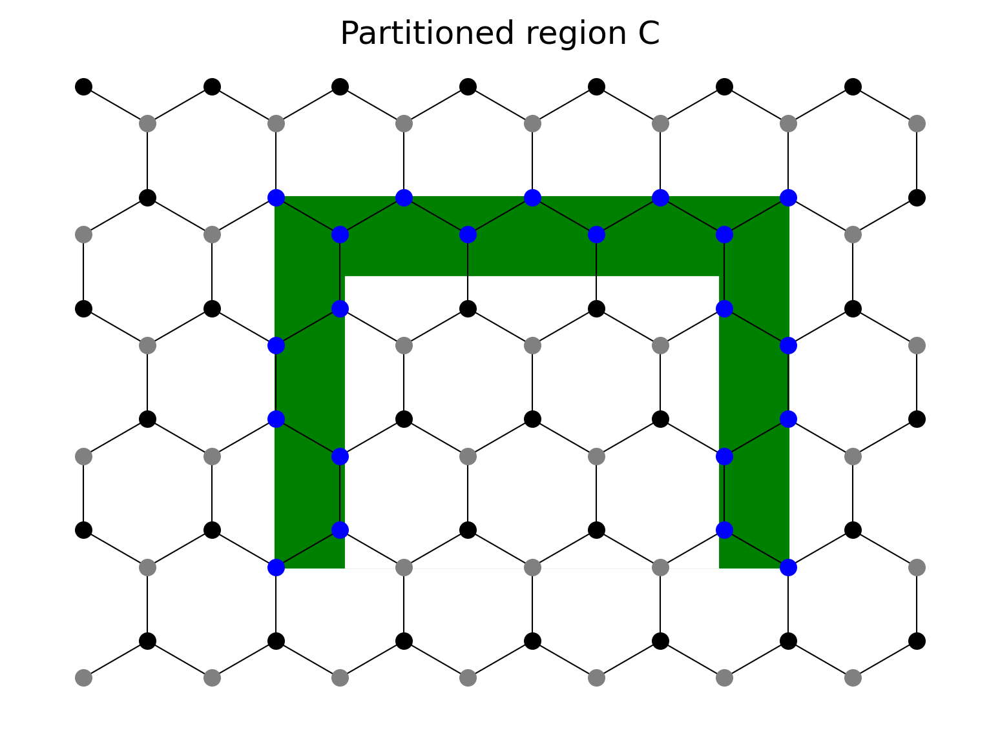
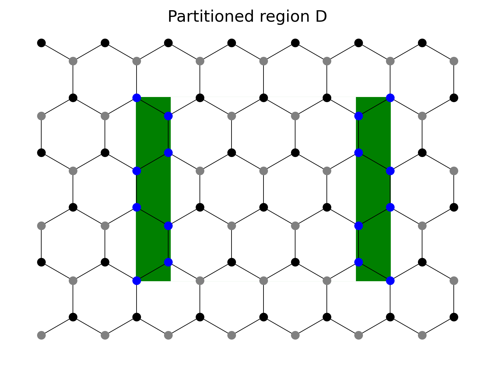

Run `plot_zgnr.py` for results in this folder. Verify whether the hopping list and coordinate function were correctly generated.

# 1. A small ZGNR

A and B carbon sites are repectively represented by black and grey colors. Nearest neighbor hoppings are visualized by solid lines.

# 2. Illustration of Wilson loop

For details of Wilson loop, see https://doi.org/10.1103/PhysRevB.103.115151

Geometrical parameters: $L_x = 7, L_y = 12, w = 2, l_\text{zig} = 9, l_\text{arm} = 4$. Solid lines corresponding to peridodic boundary conditions are intentionally omitted.

